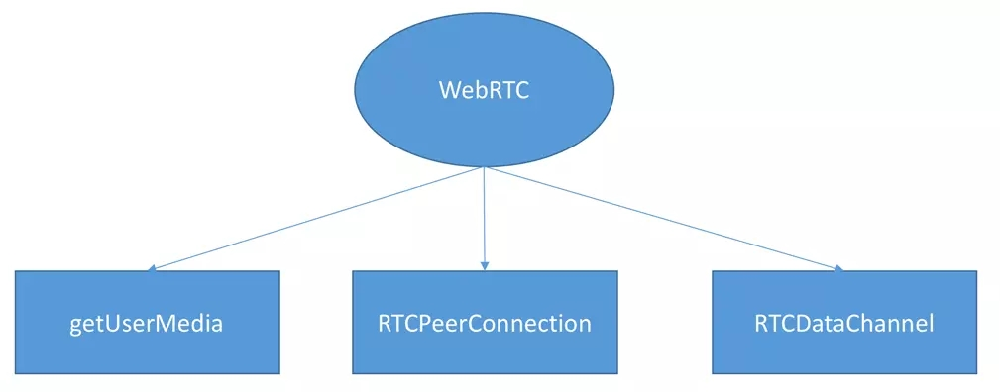

## WebRTC 简介
  ```
    WebRTC(Web Real-Time Communication) 网页即时通信 ，是一个支持网页浏览器进行实时语音、视频对话的API。
    于2011年6月1日开源并在Google、Mozilla、Opera支持下被纳入万维网联盟的W3C推荐标准
  ```
  ```
    闲话：目前主流实时流媒体 实现方式
    RTP :(Real-time Transport Protocol) 建立在 UDP 协议上的一种协议加控制

    HLS（HTTP Live Streamin）苹果公司实现的基于HTTP的流媒体传输协议

    RTMP（Real Time Messaging Protocol） Adobe公司基于TCP

    WebRTC google 基于RTP协议
  ```

### WebRTC组成
  

  - getUserMedia负责获取用户本地的多媒体数据

  - RTCPeerConnection负责建立P2P连接以及传输多媒体数据。

  - RTCDataChannel提供的一个信令通道实现双向通信

### h5 获取媒体流
  > 目标：打开摄像头将媒体流显示到页面

  [MediaDevices 文档](https://developer.mozilla.org/en-US/docs/Web/API/MediaDevices/getUserMedia)

```js
  navigator.mediaDevices.getUserMedia({
    video: true, // 摄像头
    audio: true // 麦克风
  }).then(steam => {
    // video标签的srcObject
    video.srcObject = stream
  }).catch(e => {
    console.log(e)
  })
```

### RTCPeerConnection
  > RTCPeerConnection api提供了 WebRTC端创建、链接、保持、监控闭连接的方法的实现
  [RTCPeerConnection MDN](https://developer.mozilla.org/zh-CN/docs/Web/API/RTCPeerConnection)

  1. 理解webRTC流程 实现本地媒体传输
  ```
    A呼叫B
    1、A 创建RTCPeerConnection，监测"icecandidate"事件,添加本地视频流
    2、B 创建RTCPeerConnection，并添加"addstream"事件
    3、A createOffer(), A将本地通话相关信息（例：音视频编解码）发送给B并自己保存
    4、B B收到信息保存，createAnswer() 把自己本地信息发给A，
    4、"icecandidate"对应的函数会被调用，B 添加候选者发来候选消息
    5、B端回调"addstrem"对应函数，播放视频
  ```


  2. 创建信令服务器 实现远程对话
  ```
  
  ```